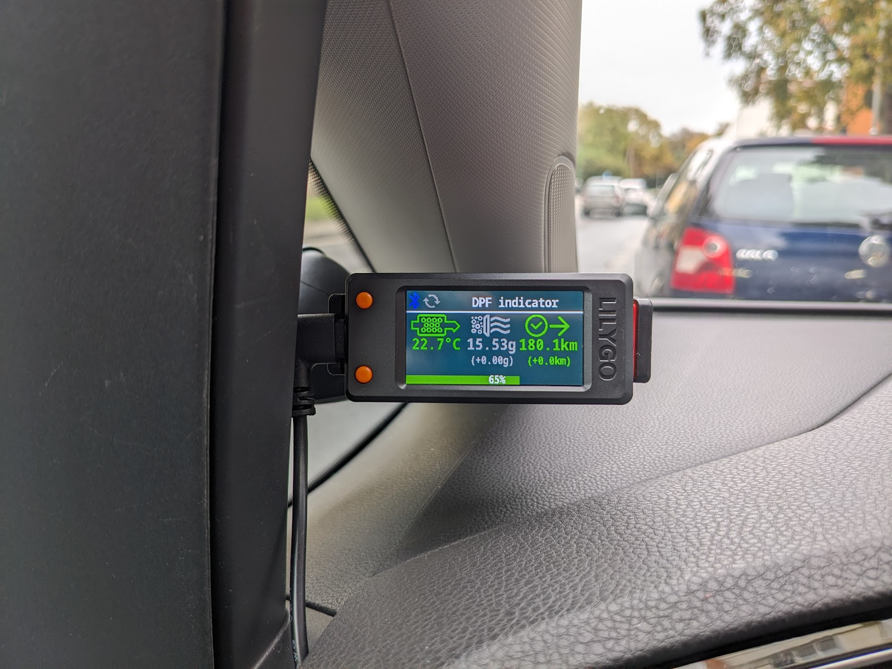
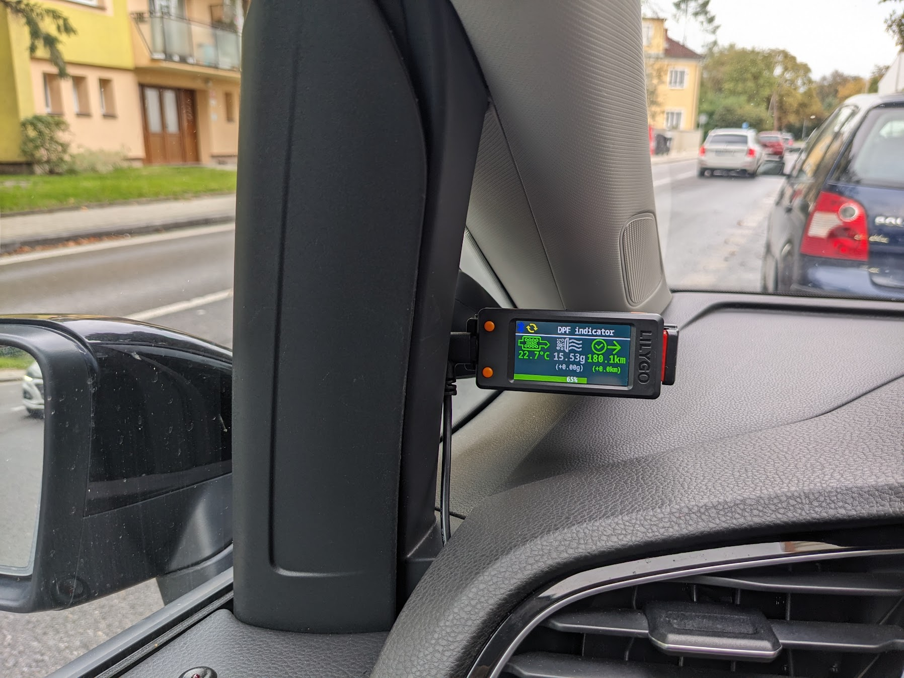

# VW DPF monitor
A little device that display the DPF status of the car

## Main components
- LILYGO® [T-Display-S3](https://lilygo.cc/products/t-display-s3) ESP32-S3 1.9 inch ST7789 LCD Display Touch Screen Development Board
- Konnwei [KW901](https://www.konnwei.com/product/448.html) V1.5 Bluetooth 5 OBD2 Scanner ELM327 V1 OBDII auto car diagnostic tool 

## Description
The device periodically reads up the DPF status via OBD2/bluetooth and display values on the display. Helps to keep the DPF in a health state by notifying the regeneration is in progress

## Features
- Display the following values:
    - DPF gas input temperature (°C)
    - Soot mass calculated (g)
    - Distance from the last regeneration (km)
    - DPF fill level status (0-100%)
- Sound notification after the regeneration starts
- Sound notification after the regeneration ends
- Display the regeneration time
- All regeneration logs in memory (downloadable via wifi client)

 
 